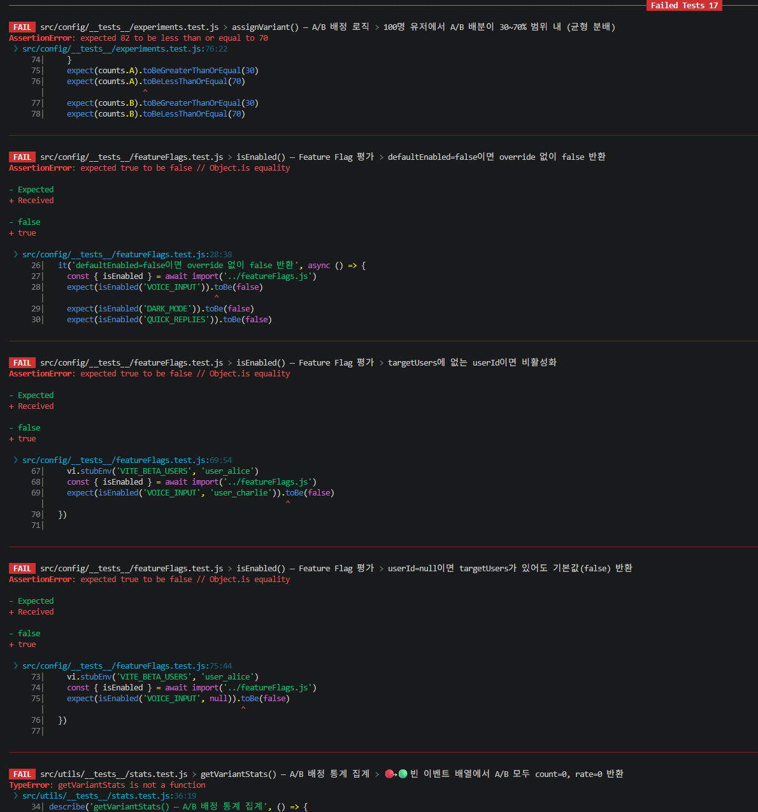
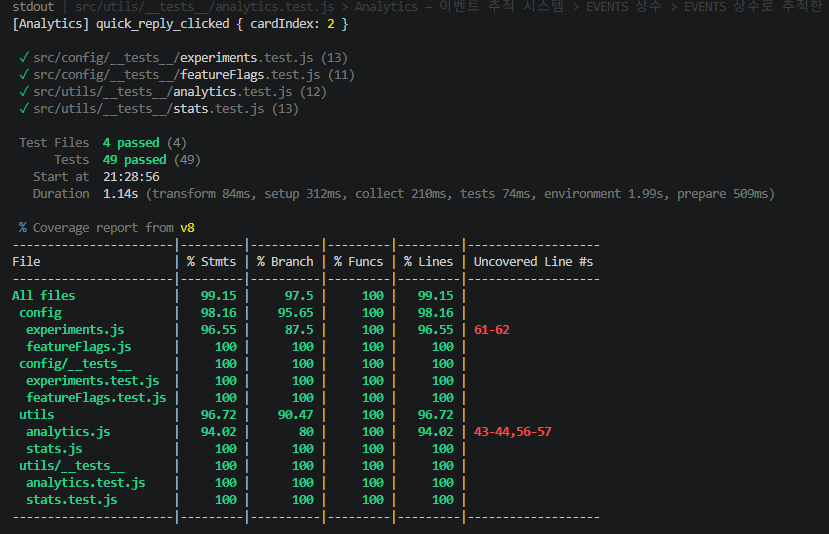

# 12주차 — 단위 테스트 & CI 자동화

## 링크

| 항목 | 링크 |
|------|------|
| 테스트 코드 | [front/app/src/config/__tests__/](config/__tests__/) |
| 테스트 코드 | [front/app/src/utils/__tests__/](utils/__tests__/) |
| CI 워크플로우 | [frontend-test.yml](../../../.github/workflows/frontend-test.yml) |
| CI 실행 결과 | [Actions](https://github.com/nadasoom2/yhs_AIOSS/actions/workflows/frontend-test.yml) |

<table>
  <tr>
    <td></td>
    <td></td>
  </tr>
</table>

---

## TDD Red-Green-Refactor 사이클

### 구현한 핵심 기능 5가지

| # | 기능 | 파일 | 테스트 파일 |
|---|------|------|------------|
| 1 | Feature Flag 평가 (`isEnabled`) | [featureFlags.js](config/featureFlags.js) | [featureFlags.test.js](config/__tests__/featureFlags.test.js) |
| 2 | 해시 기반 버켓팅 (`hashString`) | [experiments.js](config/experiments.js) | [experiments.test.js](config/__tests__/experiments.test.js) |
| 3 | A/B 배정 로직 (`assignVariant`) | [experiments.js](config/experiments.js) | [experiments.test.js](config/__tests__/experiments.test.js) |
| 4 | 이벤트 추적 (`track / getEvents / clearEvents`) | [analytics.js](utils/analytics.js) | [analytics.test.js](utils/__tests__/analytics.test.js) |
| 5 | A/B 통계 집계 (`getVariantStats / getTopEvents`) | [stats.js](utils/stats.js) | [stats.test.js](utils/__tests__/stats.test.js) |

### Feature 5 — 완전한 TDD 사이클 예시

```
🔴 Red    stats.js 없이 stats.test.js만 존재 → npm test → 전부 실패
🟢 Green  stats.js 구현 추가 → npm test → 전부 통과
🔵 Refactor  중복 제거, 변수명 명확화 → 테스트 여전히 Green 유지
```

---

## 테스트 실행 방법

```bash
cd front/app
npm install
npm test                # 단순 실행
npm run test:coverage   # 커버리지 측정 (80% 임계값)
```

## 커버리지 기준

| 항목 | 임계값 |
|------|--------|
| Lines | ≥ 80% |
| Functions | ≥ 80% |
| Branches | ≥ 80% |
| Statements | ≥ 80% |

커버리지 대상: `src/config/**`, `src/utils/**`

---

## CI 자동 실행 조건

`main` 브랜치에 `front/**` 경로 변경이 push 또는 PR될 때 자동 실행되며,
커버리지 80% 미달 시 CI가 실패합니다.
